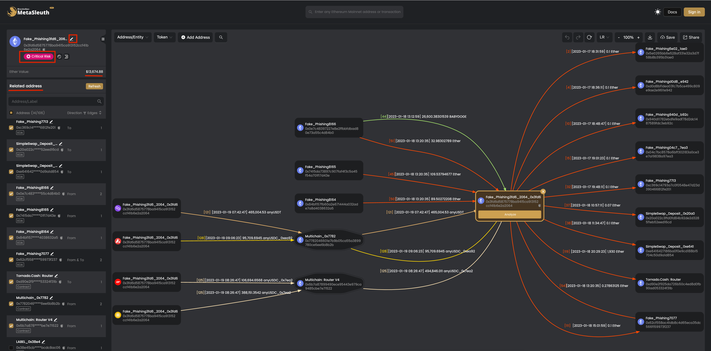
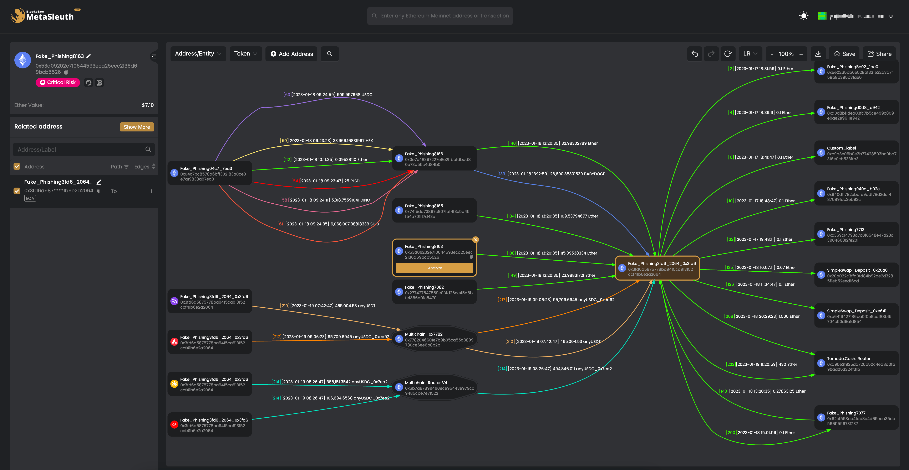

Users can actively enter any address or transaction on [https://metasleuth.io](https://metasleuth.io) and click the `Analyze` button to start the analysis.

We use this [phishing address](https://metasleuth.io/result/eth/0x3fd6d5875778bA9415CA913152CcF41b6E2a2064) ([https://etherscan.io/address/0x3fd6d5875778ba9415ca913152ccf41b6e2a2064](https://etherscan.io/address/0x3fd6d5875778ba9415ca913152ccf41b6e2a2064)) as an example.

## Intelligent Analysis

The system performs an intelligent analysis of the address/transaction entered by the user and quickly generates a fund 
flow map based on the transaction records of the corresponding address. Compared to [MetaDock](https://docs.metasleuth.io/user-manual), Metasleuth's enhanced fund flow map can track transaction records between multiple addresses, making in-depth AML tracking and analysis easy.

Our intelligent analysis supports cross-chain transactions, which means the transactions of multiple chains can be analyzed in our system.

For this phishing address, you can see the result in the following figure.

The node on the map represents an address, and the edge represents the token transfers between addresses. For better illustration, we merge multiple token transfers into one edge if the transferred tokens are the same. You can click on the edge to show [detailed information about the edge](https://docs.metasleuth.io/user-manual#token-transfers-and-transactions).

From the analysis, we can see the unique features of MetaSleuth.

- **Rich address label**. The address is labeled as Fake_Phishing3fd6_2064. Our internal system generates this label and applies it to risky addresses (Etherscan does not mark it).

- **Cross-chain analysis**. The transactions on  Avalanche are also shown on the map. That's because there are cross-chain transactions between the addresses on both these chains.

For a human-readable fund flow map, MetaSleuth does not show all the interacted addresses and edges. A user can click on the node to show the details of an address and their interacted addresses.
 
**The intelligent analysis can also be performed on any address on the map by clicking the Analyze button on each node.**

## Address Details

Users can click on the address node to show the details of an address. The clicked address is highlighted on the map.

The left panel will show the address details.

## Address information

This panel will show the current address label, the [address compliance score](https://docs.metasleuth.io/user-manual), and the native token balance in USD. We will show the link to the corresponding blockchain browser (e.g., Etherscan) and DeBank.

The address label can be customized by clicking on the  icon. All the customized address labels will be shown in the `Customization` menu if the user logins into the system.  

## Related addresses

This list shows the related addresses of the clicked address node. As explained previously, the map only shows the limited number of interacted addresses for better illustration, this list shows *the nearly completed interacted addresses*.

The user can select an address to make the address shown on the map. Also, the  icon and the  icon can be used to filter addresses.
For instance, we can search `multichain` to locate cross-chain transactions. The found addresses can be selected by clicking on the  icon.

The `Refresh` button is used to refresh the address list. If the system thinks the address list is not complete, then a Show More button will be shown instead of the `Refresh` button.

## Token Transfers and Transactions

The user can click on the edge between two addresses to show the `token transfer panel` on the bottom.

The panel shows the transferred tokens between these two addresses. As discussed previously, the token transfer transactions between two addresses are merged if the transferred tokens are the same. The user can click more to see the transaction list involved in this toke transfer (the transaction list panel).
The user can add a note for the transaction. They can also see the transaction on Etherscan or Phalcon by clicking the corresponding icon. 

## Main Operations on the Map

[img_2.png](images/img_2.png)
*MetaSleuth’s main UI components (the number is related to the icon on the figure)*

❶ The `filter` provides a filter for addresses/entities and tokens, allowing users to filter the specified addresses/tokens and generate the corresponding fund flow map based on them.
❷ The `Add Address` button enables users to add additional addresses and automatically create associations with existing addresses on the canvas.
❸ The `search` icon allows users to search for a specific address on the canvas and highlight it, making it easy to locate the corresponding address on the map quickly.
❹ The `Undo/Redo` button is one of the frequently used functions that allows users to undo or resume any operation after it has been performed.
❺ A `Reset` button that centers all nodes on the canvas and maintains a 100% zoom ratio to prevent loss of focus.
❻ The `layout` selector offers four layout options (left to right, right to left, top to bottom, and bottom to top) to accommodate different user reading habits.
❼ A `zoom ratio scale` that allows users to adjust the zoom ratio of the entire transaction flow map.
❽ The `Download` button lets you download the current analysis results locally in PNG or SVG format.
❾ The `Save` button allows users to save the current analysis results to their accounts.
❿ The `Share` button allows users to share the current analysis results to other platforms with a single click, with a customizable link expiration time. Users can also decide whether to include tags used in the analysis in the shared link (see the following Figure). 

## Share the Map

MetaSleuth supports sharing the analysis result with other users so that other users can view and even perform further analysis on the shared map.

### Create a Share Map

Click on the `Share` button to create a share of the current map. A login is needed for this feature. When sharing the map, the user can choose whether share the customized label on the map (say if the users add customized labels) for some addresses. Also, an expiration date for the share is needed. Currently, the longest sharing is three months. 

The link for this sharing [is here (Valid before 2023/04/19)](https://metasleuth.io/result/eth/0x3fd6d5875778bA9415CA913152CcF41b6E2a2064?source=7ab390ee-4f9d-4162-a26b-525b3cbc703b). Anyone with the link can view the shared map.

### Perform Further Analysis on the Shared Map

If the user can perform further analysis on the shared map, e.g., adding or filtering more nodes, the user can click the  button (login required).

If the shared map contains customized labels (and the user who creates the map intends to share the customized labels), then a window of whether to import the labels will be displayed.

If the customized labels are imported, they will be saved into the user's accounts.

Then the users can perform further analysis. For instance, we can click on an address and add more nodes to the map. The analysis can also be saved or shared with others.

## User Dashboard

Click the top right to show the user dashboard menu. The user can see the `customized data`, `saved and shared maps`.

### Customization

This menu shows the customized address label and note, the transaction note. The user can also add a new one or edit/delete the label.

### Shared Links

All the shared links will be shown. The users can edit, copy the link and delete the share of the map.

### Saved Charts

The user can view all the saved maps. They can perform further analysis on the saved maps.

