This user manual will introduce you to the various features and functions of Phalcon explorer. For better illustration, we use [this transaction](https://explorer.phalcon.xyz/tx/eth/0xa03286873c7e17a1b9dcb7546546b599bccb264ba6cb216db5a658c43b7da01e) on Ethereum as an example.

## Transaction Search

To search for a transaction, go to the [Phalcon Explorer homepage](https://explorer.phalcon.xyz/) and enter the transaction hash in the search box. Click on the result to view the transaction parsing details page. You can click the sample transactions at the bottom to have a test drive.
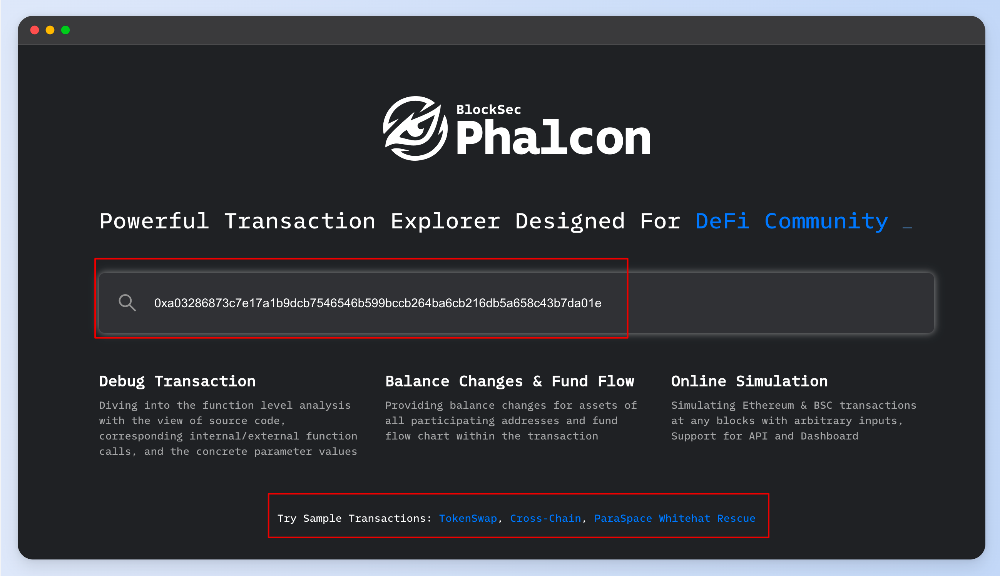

## Transaction Analysis

The transaction result page is divided into the following main modules for a transaction.

- Basic Info
- Fund Flow
- Balance Changes
- Gas Profiler
- State Changes
- Invocation Flow

### Basic Information

The **Basic Info** displays the basic information of the transaction, including the execution status (**Status**), the sender (**Sender**), and the recipient (**Receiver**).

The internal transaction count indicates the number of internal transactions, which can be used to determine the complexity of the transaction. The higher the value, the more complex the transaction.

The **[Simulate This Tx]** button in the top right corner allows you to quickly simulate the results of the current transaction at different Block Number [`BlockNum`] and position [`position in the block`] ([The transaction simulation be explained in this Section](https://docs.phalcon.xyz/phalcon-explorer/user-manual#transaction-simulation)).

### Fund Flow
The `Fund Flow` module illustrates the flow of tokens involved in the transaction as a directed graph. Different nodes represent different addresses, and a different background color distinguishes nodes representing the sender or recipient of a transaction.

The directed edge and the information on the edge show the transfer direction, the token, and the number of tokens transferred.

- Different serial numbers on the edges are used to distinguish the chronological order of the token transfers.

- Edges of the same color identify transfers of the same token,

- The same directional flow of the same token between two addresses is merged to simplify the transaction's fund flow map while preserving the characteristics of the token transfer.

The module also provides the ability to zoom in and out of the flow chart in the top right corner. The fund flow graph can be downloaded as SVG or PNG file.
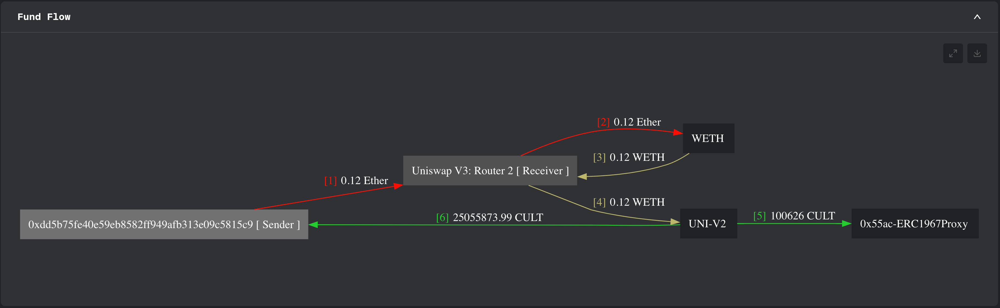

### Balance Changes
The `Balance Changes` shows the accounts that have a change in the token balance after the transaction is executed.

The first column lists the addresses with a net inflow or outflow of tokens.

The second column lists the token information, including the names of the token that flows in or out of the address.

The third column shows the change in balance, i.e., the token inflow or outflow amount.

The last column shows the value of the number of tokens flowing in or out of each account when the transaction occurred.

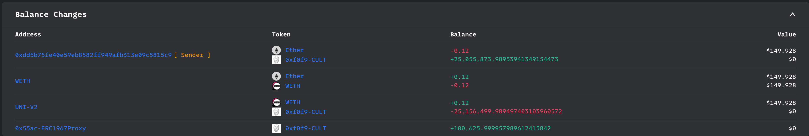

### Gas Profiler

The gas profiler uses the [Flame Graph](https://www.brendangregg.com/flamegraphs.html) to show the gas used in each function invocation.

Each line in the graph denotes the gas used in each function. Click the function name to show the detailed gas used inside that function.

### State Changes

The state changes show the changes of the storage memory in this transaction.

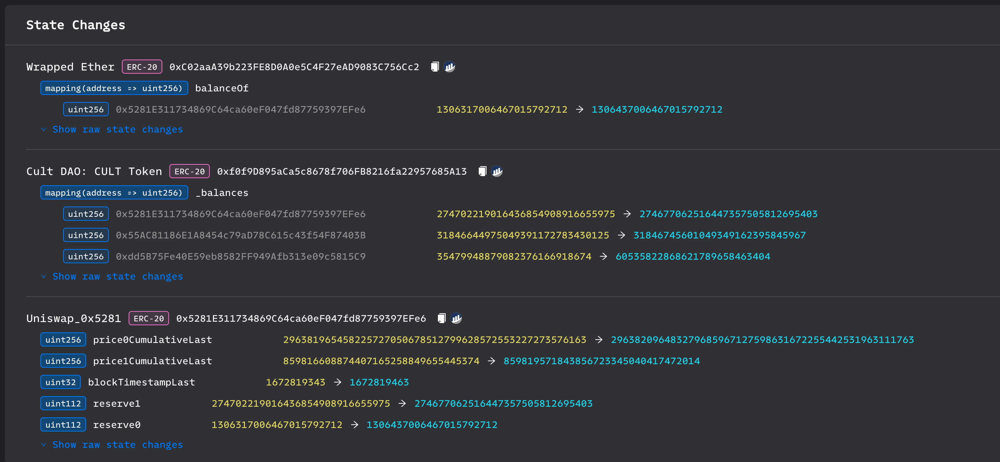

For the storage that can be parsed, we show the detailed changes. For instance, the `balanceOf` of the address `0x5281E311734869C64ca60eF047fd87759397EFe6` has been changed from `1306317006467015792712` to `1306437006467015792712`.

This feature is particularly useful when you need an overview of the change to some critical states. For instance, in the recent [Tornado Cash Dao attack incident](https://explorer.phalcon.xyz/tx/eth/0x3274b6090685b842aca80b304a4dcee0f61ef8b6afee10b7c7533c32fb75486d), using this feature can quickly detect malicious proposals to change the locked Balance in Governance for 100 addresses directly.

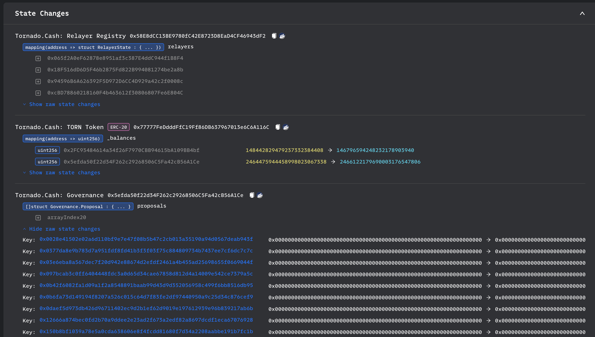

### Invocation Flow

Invocation Flow displays the sequence of function calls in a transaction as a tree structure.

Each node represents a function call or event trigger and includes information such as call stack depth, call type, and call parameters. A search box and a drop-down selection box for call type and expansion are provided at the top of the module to assist users in interpreting the transaction execution flow.

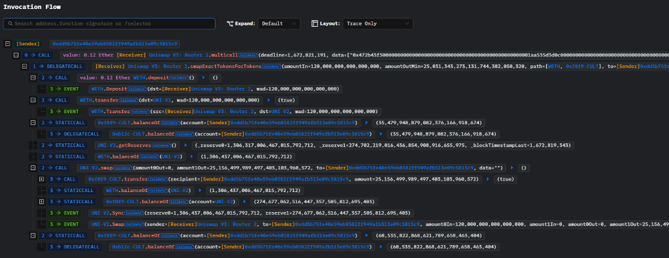

Users can search for and filter desired call flow information by entering an address, function signature, or function selector in the search box. The following figure shows the result of filtering through the `WETH` address.

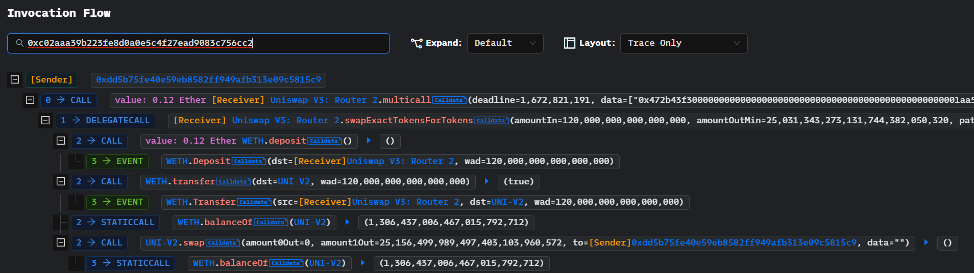

The call stack depth can be selected by the user using the drop-down selection box. The following figure shows the call flow display after selecting a call stack depth of 2.

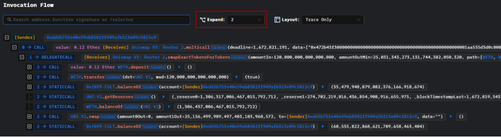

## Customization

Phalcon supports customizations to facilitate the analysis.

### Custom Highlight

The address, function, and event can be highlighted with a custom color during the analysis.

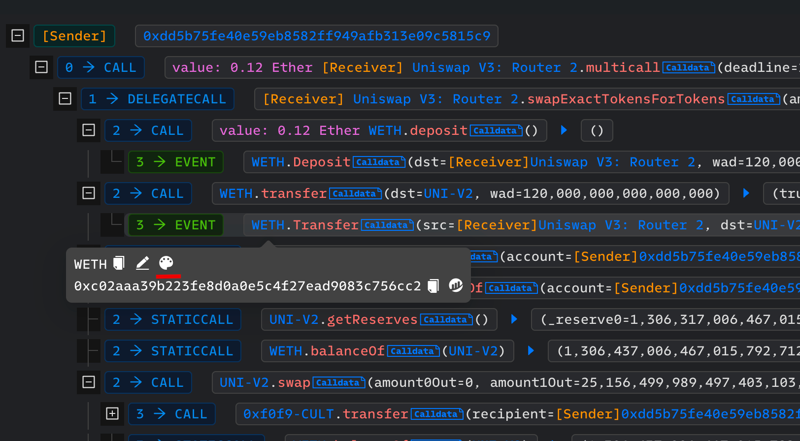

### Custom Label

The address, function, and event can be set with custom labels.

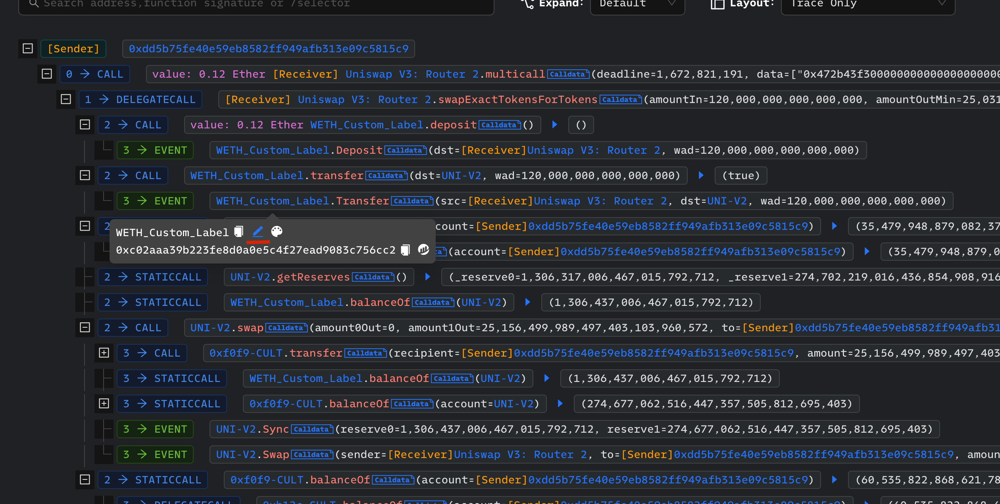

### Custom Function Signature

For the `calldata` of a contract, a custom function signature can be provided to decode the `calldata`.

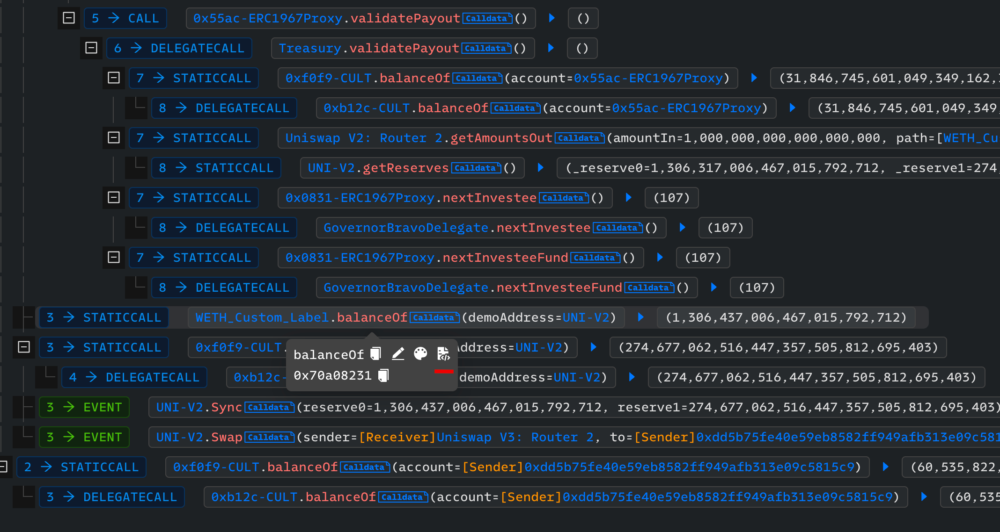